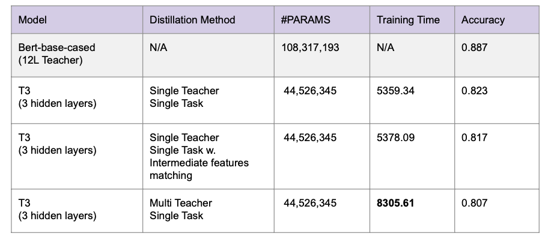
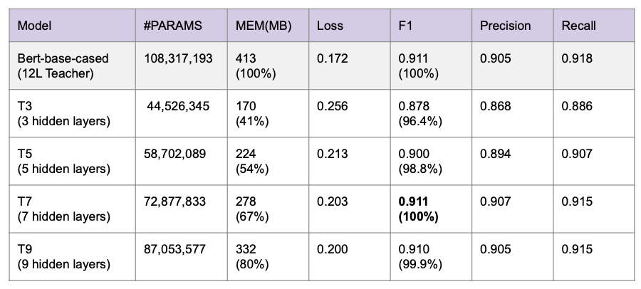
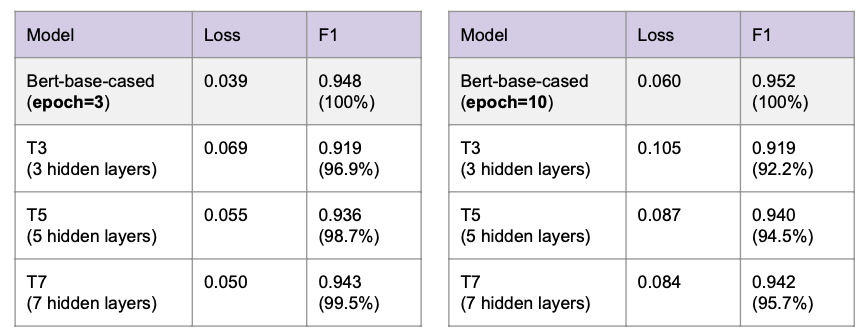
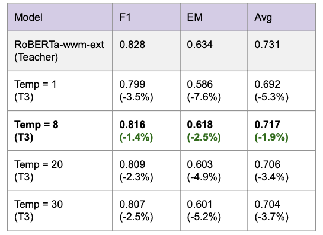

# knowledge_distill_nlp

Final project of COMSE6998 Practical Deep Learning (SP22)
Team members:
- Xilin Wu (xw2805)
- Haoxiong Su (hs3228)

## Introduction
Nowadays applications of large-scaled pretrained language models for various downstream tasks are common in the natural language processing (NLP) area. We want to explore methods of knowledge distillation (KD) used to reduce the size of such models while applying them to different downstream tasks.

The goals of this project include:
- Compare advantages and disadvantages of different knowledge distillation methods
- Check how well distilled models could learn from underfit and converged teacher models
- Investigate trade-off between complexity of distilled models (student model) and model performances
- Explore effect of different temperature values on transferring knowledge from teacher model to distilled model

We conducted 4 experiments on 3 downstream tasks: Text classification, Sequence Labeling and Machine Reading Comprehension, where we study the impact of different distillation methods, teacher models, complexities and temperature by, comparing the performance of student models .

## Installation
To install pakage `TextBrewer`, follow [TextBrewer repo](https://github.com/airaria/TextBrewer).

Another way to use codes of this repositary, you could install dependecies using `pip install -r requirements.txt`.

To download RoBERTa-wwm-ext used in MRC task, follow [Chinese-BERT-wwm repo](https://github.com/ymcui/Chinese-BERT-wwm).

## Data
The dataset used in the project lies under folder `data`, which contains:
- coNLL-2003 (Named Entity Recognition)
- CMRC (Chinese Machine Reading Comprehension)

## Usage
### Text Classification Task
For the entire experiment:
```
cd code/TextClassification
python sst2_train.py #Train teacher model
python sst2_distill.py # Start distillation
```
For saving some time and not running the multi-teacher model:
```
cd code/TextClassification
python sst2_train_single.py #Train teacher model
python sst2_distill_single.py # Start distillation
```

### Sequence Labeling Task
```
cd code/NER
bash run_conll2003_train.sh # Train teacher model
bash run_conll2003_distill_T3.sh # Start distillation
```
To train teacher models, you should specify the output directory of saving model weights.

To start distillation, you should also specify the directory of trained teacher model.

### Machine Reading Comprehension Task
```
cd code/MRC
bash run_cmrc2018_train.sh.sh # Train teacher model
bash run_cmrc2018_distill_T3.sh # Start distillation
```
To train teacher models, you should specify the pretrained model directory and output directory of saving model weights.

To start distillation, you should also specify the directory of trained teacher model.

### Check Performance
You could use `check_model_performance.ipynb` to extract information about training and evaluatio results from logs under folder `log`.

## Experiment Results
Experiment 1: Effect of distillation method on performance of student models


Experiment 2: Effect of #layers on performance of student models


Experiment 3: Effect of convergence of teacher models on performance of student models


Experiment 4: Effect of temperatures used in softmax on transferability of knowledge


